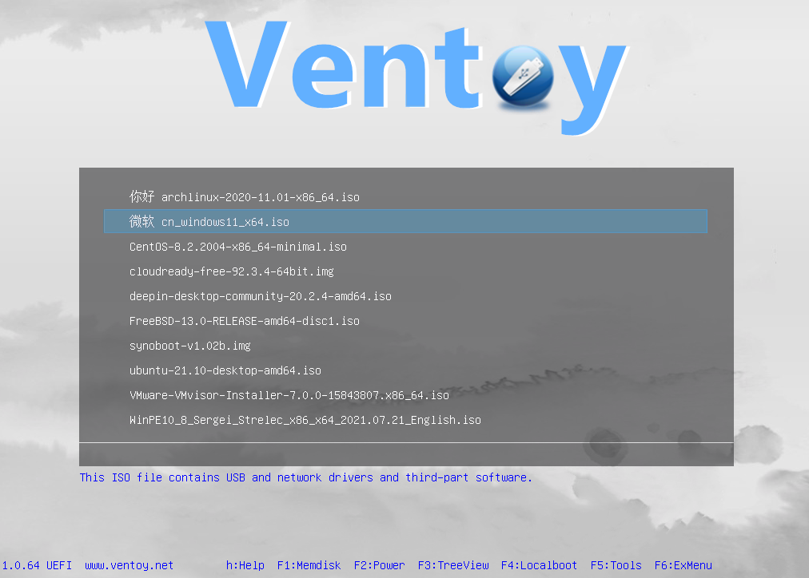
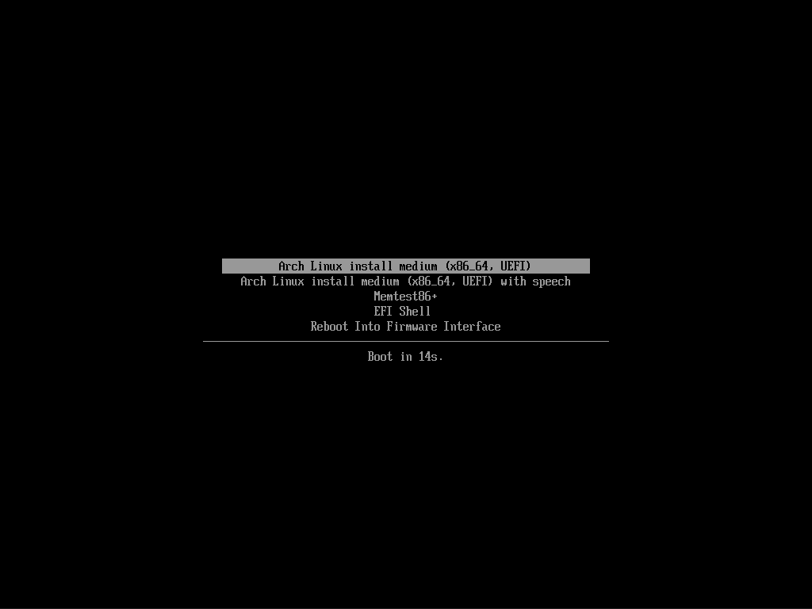
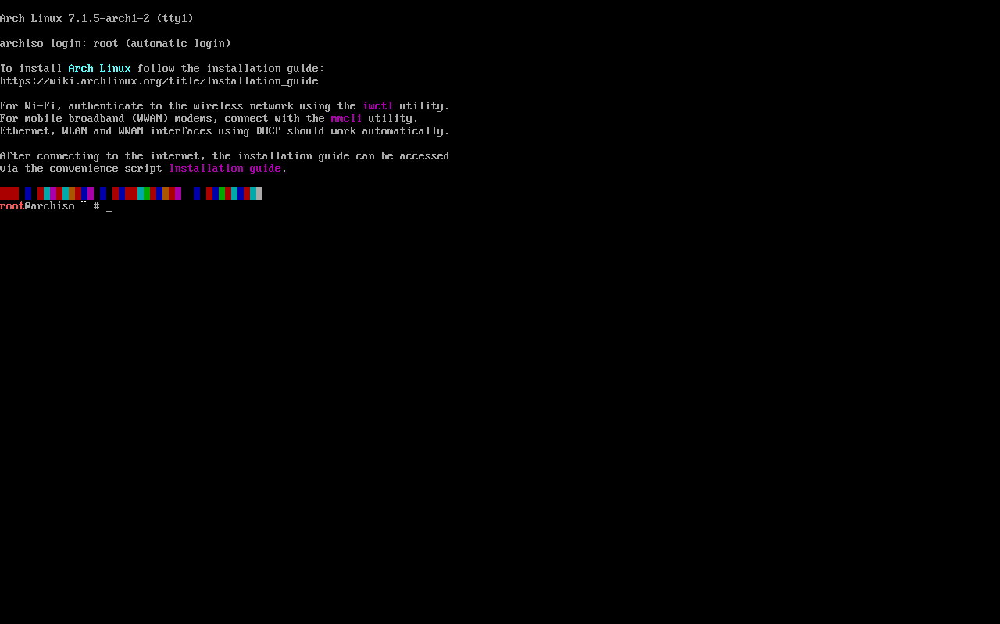
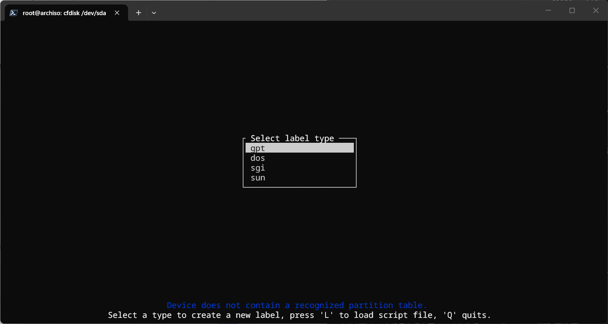
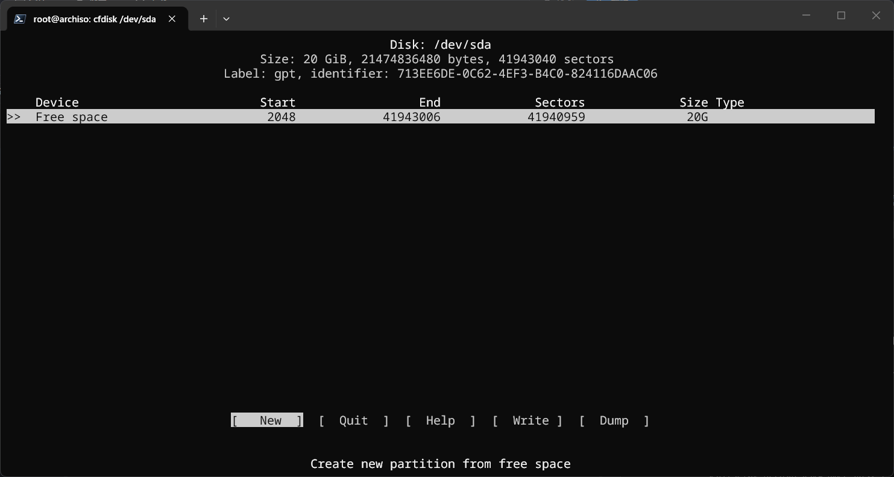
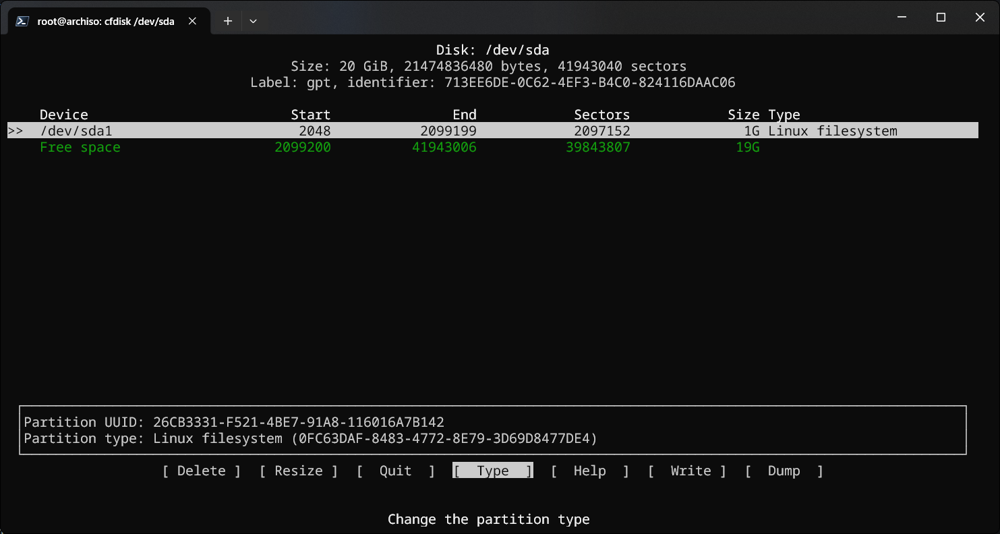
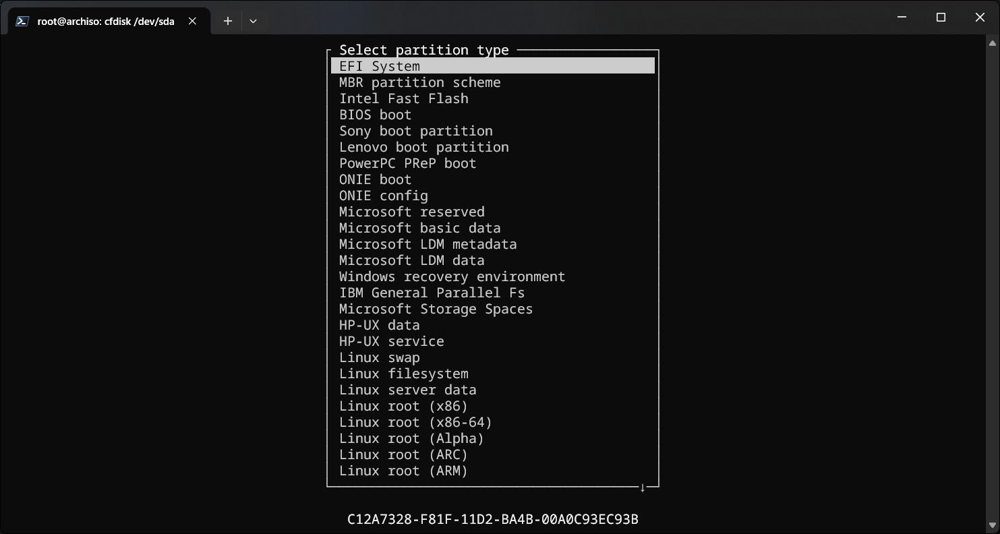
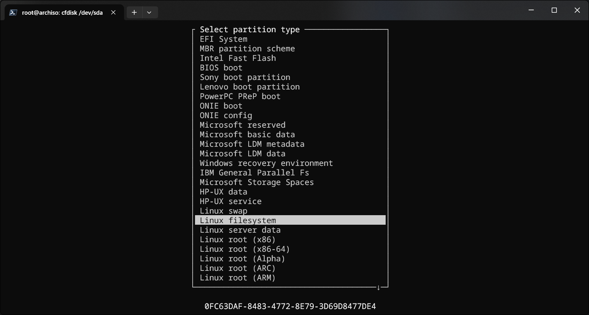
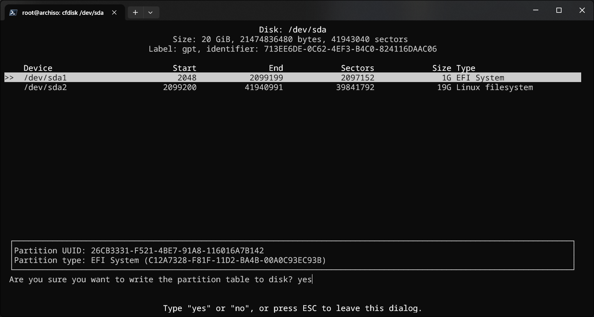

> [!CAUTION]
> 本教程还在**编写**阶段！

## 写在前头

这是我的博客的第一篇教程，我一直在想该写什么好。最后还是决定写一写Arch的安装，用来熟悉一些md语法。如果有任何错误请谅解。

## 正文

> [!TIP]
> 我们不建议初学者使用Arch Linux作为使用的第一个发行版。

> [!TIP]
> 遇到任何问题可以去[Arch Wiki](https://wiki.archlinuxcn.org/wiki/)上寻找答案。

### 我需要什么？
 - 一台 `x86_64` 的电脑。
 - 一块至少**8G**的U盘。

### 什么是Arch_Linux

> Arch Linux 作为一种通用 Linux 发行版，它的初始安装仅提供命令行环境。由于 Arch 默认提供最小化安装，用户不需要删除大量不需要的软件包，而是可以从官方软件仓库成千上万的高质量软件包中进行选择，用于搭建自己的系统。目前仅支持 x86-64 架构。( 对 i686 架构的支持已经结束）\
> ——摘自[Arch Wiki](https://wiki.archlinuxcn.org/wiki/Arch_Linux)

### 安装前准备

#### 获取安装镜像

打开官方镜像链接 [Arch Linux Downloads](https://archlinux.org/download/)，
在其中的 `BitTorrent Download (recommended)` 下选择一个合适你的链接，可以使用 [Free Download Manager](https://www.freedownloadmanager.org/zh/) 或迅雷下载磁力链接或BT种子。
  
完成后你应该会得到一个形如 `archlinux-2026.08.01-x86_64.iso` 的ISO文件。
  
有条件的可以使用如 [7-ZIP](https://7-zip.org/download.html) 或 `sha256sum` 命令来校验。

### 制作安装介质
我们考虑使用 [Ventoy](https://www.ventoy.net/cn/download.html) 制作安装介质。
  
打开上方链接按自己的系统类型下载。

> [!NOTE]
> 因为 `Ventoy` 安装包托管在 Github 上，中国大陆用户可能无法访问，你可以使用网页下方的其他链接，如 [蓝奏云](https://www.lanzoui.com/b01bd54gb)

你应该得到一个形如 `ventoy-1.1.17-windows.zip` 的压缩包，解压它。
  
找到其中的 `Ventoy2Disk.exe` 文件运行它。
  
> [!CAUTION]
> 此操作会清除U盘中的**一切数据**。\
> 数据无价请做好备份！

把你的U盘插进去。在上方选择框中选择你的U盘。然后按左下角的 `安装` 键。二次确认后开始安装。
  
安装完成后你的U盘的卷标应变为 `Ventoy`。把你先前下载的 `Arch Linux` 安装镜像复制到U盘中。
  
至此制作安装介质**完成**！

### 启动到LiveCD
> [!WARNING]
> Arch Linux 安装映像不支持 UEFI 安全启动（Secure Boot）功能。如果要引导安装介质，需要禁用安全启动。
 
 1. 把U盘插入待装电脑。开机，在主板自检时快速按下 `快捷启动键`（参考下表），进入快捷启动界面。
 
 <table border="1" cellpadding="5" style="border-collapse: collapse; text-align: center;">
    <thead>
        <tr>
            <th rowspan="2">主板品牌</th>
            <th colspan="2">快捷按键信息</th>
        </tr>
        <tr>
            <th>名称</th>
            <th>数值</th>
        </tr>
    </thead>
    <tbody>
        <tr>
            <td rowspan="2">华硕 (ASUS)</td>
            <td>快捷启动键</td>
            <td>F8</td>
        </tr>
        <tr>
            <td>进入BIOS键</td>
            <td>Del 或 F2</td>
        </tr>
        <tr>
            <td rowspan="2">技嘉 (Gigabyte)</td>
            <td>快捷启动键</td>
            <td>F12</td>
        </tr>
        <tr>
            <td>进入BIOS键</td>
            <td>Del</td>
        </tr>
        <tr>
            <td rowspan="2">微星 (MSI)</td>
            <td>快捷启动键</td>
            <td>F11</td>
        </tr>
        <tr>
            <td>进入BIOS键</td>
            <td>Del</td>
        </tr>
        <tr>
            <td rowspan="2">华擎 (ASRock)</td>
            <td>快捷启动键</td>
            <td>F11</td>
        </tr>
        <tr>
            <td>进入BIOS键</td>
            <td>Del 或 F2</td>
        </tr>
        <tr>
            <td rowspan="2">联想 (Lenovo)</td>
            <td>快捷启动键</td>
            <td>F12</td>
        </tr>
        <tr>
            <td>进入BIOS键</td>
            <td>F2 或 Fn+F2</td>
        </tr>
        <tr>
            <td rowspan="2">惠普 (HP)</td>
            <td>快捷启动键</td>
            <td>F9</td>
        </tr>
        <tr>
            <td>进入BIOS键</td>
            <td>F10 或 ESC</td>
        </tr>
        <tr>
            <td rowspan="2">戴尔 (Dell)</td>
            <td>快捷启动键</td>
            <td>F12</td>
        </tr>
        <tr>
            <td>进入BIOS键</td>
            <td>ESC</td>
        </tr>
        <!-- 补充几个遗漏的常见品牌 -->
        <tr>
            <td rowspan="2">映泰 (BIOSTAR)</td>
            <td>快捷启动键</td>
            <td>F9</td>
        </tr>
        <tr>
            <td>进入BIOS键</td>
            <td>Del</td>
        </tr>
        <tr>
            <td rowspan="2">七彩虹 (Colorful)</td>
            <td>快捷启动键</td>
            <td>ESC 或 F11</td>
        </tr>
        <tr>
            <td>进入BIOS键</td>
            <td>Del 或 F2</td>
        </tr>
        <tr>
            <td rowspan="2">Intel (原厂主板)</td>
            <td>快捷启动键</td>
            <td>F12</td>
        </tr>
        <tr>
            <td>进入BIOS键</td>
            <td>F2 或 Del</td>
        </tr>
    </tbody>
</table>

2. 选择你的U盘，回车进入 Ventoy 界面（如下图）。



3. 选择其中的 `archlinux-2026.08.01-x86_64.iso`（具体名字参考你的 ISO 镜像文件）文件。两次回车进入 LiveCD。



4.按回车或等待 15 秒，等一段跑码，就会进入到一个类似下面的界面：



至此启动到 LiveCD 就**完成**了！

### 正式安装

> [!NOTE]
> 你可以通过命令前的 `#` 或 `$` 符号判断当前命令是用 `root` 用户执行还是普通用户。

#### 网络链接

> [!NOTE]
> 使用 `Tab` 键补全命令和路径。
> 使用 `clear` 命令清屏。


> [!TIP]
> 若有条件，我们建议直接使用以太网线连接电脑。

分两种情况，请按照选择自己的情况选择。

##### 有线网络

若你直接将电脑用一根以太网线连到路由器或光猫上，那么你的网络大概率已经连接成功了。
  
使用如下命令测试
  
```bash
$ ip a
1: lo: <LOOPBACK,UP,LOWER_UP> mtu 65536 qdisc noqueue state UNKNOWN group default qlen 1000
    link/loopback 00:00:00:00:00:00 brd 00:00:00:00:00:00
    inet 127.0.0.1/8 scope host lo
       valid_lft forever preferred_lft forever
    inet6 ::1/128 scope host noprefixroute
       valid_lft forever preferred_lft forever
2: enp0s3: <BROADCAST,MULTICAST,UP,LOWER_UP> mtu 1500 qdisc fq_codel state UP group default qlen 1000
    link/ether 08:00:27:d2:28:a3 brd ff:ff:ff:ff:ff:ff
    altname enx080027d228a3
    inet 192.168.0.105/24 metric 100 brd 192.168.0.255 scope global dynamic enp0s3
       valid_lft 6509sec preferred_lft 6509sec
    inet6 fd00:3c6a:4854:2dd3::1005/128 scope global dynamic noprefixroute
       valid_lft 85710sec preferred_lft 85710sec
    inet6 fd00:3c6a:4854:2dd3:ec00:2ce9:e815:8ed1/64 scope global temporary dynamic
       valid_lft 86370sec preferred_lft 14370sec
    inet6 fd00:3c6a:4854:2dd3:a00:27ff:fed2:28a3/64 scope global dynamic mngtmpaddr noprefixroute
       valid_lft 86370sec preferred_lft 14370sec
    inet6 fe80::a00:27ff:fed2:28a3/64 scope link proto kernel_ll
       valid_lft forever preferred_lft forever
```

若除了 `127.0.0.1` 以外还有 ip 地址则连接成功。
  
现在我们测试互联网连接，使用以下命令，若 ping 通则按 `Ctrl+C` 键打断。

> [!NOTE]
> Linux 命令 `ping` 需要 `Ctrl+C` 键手动打断。

```bash
$ ping www.bilibili.com
PING a.w.bilicdn1.com (117.21.179.20) 56(84) bytes of data.
64 bytes from 117.21.179.20: icmp_seq=1 ttl=54 time=16.8 ms
64 bytes from 117.21.179.20: icmp_seq=2 ttl=54 time=13.4 ms
64 bytes from 117.21.179.20: icmp_seq=3 ttl=54 time=12.4 ms
64 bytes from 117.21.179.20: icmp_seq=4 ttl=54 time=11.5 ms
^C
--- a.w.bilicdn1.com ping statistics ---
4 packets transmitted, 4 received, 0% packet loss, time 7384ms
rtt min/avg/max/mdev = 11.454/13.512/16.806/2.020 ms
```

像这样代表你与 [B站](https://www.bilibili.com) 的网络是通畅的（当然你也可以把上面的 `www.bilibili.com` 换成别的网址（注意不要加 `http://` 或 `https://`），如 `www.baidu.com`）。

##### 无线网络

为了连接无线网络，我们要使用命令 `iwctl`。

```bash
# iwctl
```

这时提示符会变成 `[iwd]#`。
  
使用 `help` 命令

```bash
[iwd]# help

                               iwctl version 3.12
--------------------------------------------------------------------------------
  Usage
--------------------------------------------------------------------------------
  iwctl [--options] [commands]

                               Available options
--------------------------------------------------------------------------------
  Options                                             Description
--------------------------------------------------------------------------------
  --username                                          Provide username
  --password                                          Provide password
  --passphrase                                        Provide passphrase
  --dont-ask                                          Don't ask for missing
                                                      credentials
  --help                                              Display help

                               Available commands
--------------------------------------------------------------------------------
  Commands                                            Description
--------------------------------------------------------------------------------

Adapters:
  adapter list                                        List adapters
  adapter <phy> show                                  Show adapter info
  adapter <phy> set-property <name> <value>           Set property

Ad-Hoc:
  ad-hoc list                                         List devices in Ad-hoc mode
  ad-hoc <wlan> start <"network name"> <passphrase>   Start or join an existing
                                                      Ad-Hoc network called "network
                                                      name" with a passphrase
  ad-hoc <wlan> start_open <"network name">           Start or join an existing open
                                                      Ad-Hoc network called "network
                                                      name"
  ad-hoc <wlan> stop                                  Leave an Ad-Hoc network

Access Point:
  ap list                                             List devices in AP mode
  ap <wlan> start <"network name"> <passphrase>       Start an access point called
                                                      "network name" with a
                                                      passphrase
  ap <wlan> start-profile <"network name">            Start an access point based on
                                                      a disk profile
  ap <wlan> stop                                      Stop a started access point
  ap <wlan> show                                      Show AP info
  ap <wlan> scan                                      Start an AP scan
  ap <wlan> get-networks                              Get network list after
                                                      scanning

Devices:
  device list                                         List devices
  device <wlan> show                                  Show device info
  device <wlan> set-property <name> <value>           Set property

Known Networks:
  known-networks list                                 List known networks
  known-networks <"network name"> forget              Forget known network
  known-networks <"network name"> show                Show known network
  known-networks <"network name"> set-property        Set property
      <name> <value>

WiFi Simple Configuration:
  wsc list                                            List WSC-capable devices
  wsc <wlan> push-button                              PushButton mode
  wsc <wlan> start-user-pin <PIN>                     PIN mode
  wsc <wlan> start-pin                                PIN mode with generated 8
                                                      digit PIN
  wsc <wlan> cancel                                   Aborts WSC operations

Station:
  station list                                        List devices in Station mode
  station <wlan> connect <"network name"> [security]  Connect to network
  station <wlan> connect-hidden <"network name">      Connect to hidden network
  station <wlan> disconnect                           Disconnect
  station <wlan> get-networks [rssi-dbms/rssi-bars]   Get networks
  station <wlan> get-hidden-access-points             Get hidden APs
      [rssi-dbms]
  station <wlan> scan                                 Scan for networks
  station <wlan> show                                 Show station info
  station <wlan> get-bsses [network] [security]       Get BSS's for a network

Device Provisioning:
  dpp list                                            List DPP-capable devices
  dpp <wlan> start-enrollee                           Starts a DPP Enrollee
  dpp <wlan> start-configurator                       Starts a DPP Configurator
  dpp <wlan> stop                                     Aborts DPP operations
  dpp <wlan> show                                     Shows the DPP state

Shared Code Device Provisioning (PKEX):
  pkex list                                           List shared code capable
                                                      devices
  pkex <wlan> stop                                    Aborts shared code operations
  pkex <wlan> show                                    Shows the shared code state
  pkex <wlan> enroll key [identifier]                 Start a shared code enrollee
  pkex <wlan> configure key [identifier]              Start a shared code
                                                      configurator

Station Debug:
  debug <wlan> connect <bssid>                        Connect to a specific BSS
  debug <wlan> roam <bssid>                           Roam to a BSS
  debug <wlan> get-networks                           Get networks
  debug <wlan> autoconnect on|off                     Set AutoConnect property


Miscellaneous:
  version                                             Display version
  quit                                                Quit program
```

接下来我们演示如何连接 Wi-Fi（请将 `wlan0` 替换为你的无线网卡设备名，将 `MyWiFi` 替换为你的 Wi-Fi 名称）。

1. 列出所有无线设备，确认你的网卡名称：

```bash
[iwd]# device list
                                    Devices
--------------------------------------------------------------------------------
  Name                  Address               Powered     Adapter     Mode
--------------------------------------------------------------------------------
  wlan0                 **:**:**:**:**:**     on          phy0        station
```

若输出如上图，那么设备名为：`wlan0`，若 `Powered` 列是 `off`。
  
那么使用以下命令打开设备：

```bash
[iwd]# device wlan0 set-property Powered on # 把“wlan0”换成你的设备名。
```

扫描附近 Wi-Fi （若无输出则成功）。

```bash
[iwd]# station wlan0 scan
```

列出扫描到的网络（找到你要连接的 SSID）。

> [!WARNING]
> 你处于 TTY 环境，由于 Linux 内核特性，TTY 中的中文会被显示为方块"□"。
> 所以不建议你使用中文 Wi-Fi 名。

```bash
[iwd]# station wlan0 get-networks
                               Available networks                             *
--------------------------------------------------------------------------------
      Network name                      Security            Signal
--------------------------------------------------------------------------------
      Wi-Fi 1                           psk                 ****
      Wi-Fi 2                           psk                 ****
      Wi-Fi 3                           psk                 ****
      Wi-Fi 4                           psk                 ****
      Wi-Fi 5                           psk                 ****
      Wi-Fi 6                           psk                 ****
      Wi-Fi 7                           psk                 ****
      Wi-Fi 8                           psk                 ****
      Wi-Fi 9                           psk                 ****
      Wi-Fi 10                          psk                 ****
```

连接网络：

```bash
[iwd]# station wlan0 connect "Wi-Fi 1" # 把“Wi-Fi 1”换成你上面看到的你的Wi-Fi名。
```

系统会提示 `Passphrase:`，输入密码后回车。
  
连接成功后，可以输入 `exit` 退出交互界面。

使用如下命令测试
  
```bash
$ ip a
1: lo: <LOOPBACK,UP,LOWER_UP> mtu 65536 qdisc noqueue state UNKNOWN group default qlen 1000
    link/loopback 00:00:00:00:00:00 brd 00:00:00:00:00:00
    inet 127.0.0.1/8 scope host lo
       valid_lft forever preferred_lft forever
    inet6 ::1/128 scope host noprefixroute
       valid_lft forever preferred_lft forever
2: enp0s3: <BROADCAST,MULTICAST,UP,LOWER_UP> mtu 1500 qdisc fq_codel state UP group default qlen 1000
    link/ether 08:00:27:d2:28:a3 brd ff:ff:ff:ff:ff:ff
    altname enx080027d228a3
    inet 192.168.0.105/24 metric 100 brd 192.168.0.255 scope global dynamic enp0s3
       valid_lft 6509sec preferred_lft 6509sec
    inet6 fd00:3c6a:4854:2dd3::1005/128 scope global dynamic noprefixroute
       valid_lft 85710sec preferred_lft 85710sec
    inet6 fd00:3c6a:4854:2dd3:ec00:2ce9:e815:8ed1/64 scope global temporary dynamic
       valid_lft 86370sec preferred_lft 14370sec
    inet6 fd00:3c6a:4854:2dd3:a00:27ff:fed2:28a3/64 scope global dynamic mngtmpaddr noprefixroute
       valid_lft 86370sec preferred_lft 14370sec
    inet6 fe80::a00:27ff:fed2:28a3/64 scope link proto kernel_ll
       valid_lft forever preferred_lft forever
```

若除了 `127.0.0.1` 以外还有 ip 地址则连接成功。
  
现在我们测试互联网连接，使用以下命令，若 ping 通则按 `Ctrl+C` 键打断。

> [!NOTE]
> Linux 命令 `ping` 需要 `Ctrl+C` 键手动打断。

```bash
$ ping www.bilibili.com
PING a.w.bilicdn1.com (117.21.179.20) 56(84) bytes of data.
64 bytes from 117.21.179.20: icmp_seq=1 ttl=54 time=16.8 ms
64 bytes from 117.21.179.20: icmp_seq=2 ttl=54 time=13.4 ms
64 bytes from 117.21.179.20: icmp_seq=3 ttl=54 time=12.4 ms
64 bytes from 117.21.179.20: icmp_seq=4 ttl=54 time=11.5 ms
^C
--- a.w.bilicdn1.com ping statistics ---
4 packets transmitted, 4 received, 0% packet loss, time 7384ms
rtt min/avg/max/mdev = 11.454/13.512/16.806/2.020 ms
```

像这样代表你与 [B站](https://www.bilibili.com) 的网络是通畅的（当然你也可以把上面的 `www.bilibili.com` 换成别的网址（注意不要加 `http://` 或 `https://`），如 `www.baidu.com`）。


至此，网络连接**完成**！

> [!NOTE]
> 你可以把另一台电脑连接到同一路由器/光猫下，记下当前电脑（待装电脑）的 ip 地址，在另一台电脑上使用 `ssh root@ip`（将 "ip" 换为你的 ip），详见：[OpenSSH - Arch Wiki](https://wiki.archlinuxcn.org/wiki/OpenSSH)


#### 更换软件源

我们可以通过更换国内软件仓库镜像源加快下载速度

使用 `vim` 编辑 `/etc/pacman.d/mirrorlist` 文件：

```bash
vim /etc/pacman.d/mirrorlist
```

> [!NOTE]
> 关于 `vim`，详见 [Vim - Arch Wiki](https://wiki.archlinuxcn.org/wiki/Vim)

> [!NOTE]
> `/etc/pacman.d/mirrorlist` 文件会在后续安装过程中被复制到新系统。

在最上面添加如下镜像源（任选其一）

```txt
Server = https://mirrors.ustc.edu.cn/archlinux/$repo/os/$arch # 中国科学技术大学开源镜像站
Server = https://mirrors.tuna.tsinghua.edu.cn/archlinux/$repo/os/$arch # 清华大学开源软件镜像站
Server = https://repo.huaweicloud.com/archlinux/$repo/os/$arch # 华为开源镜像站
Server = http://mirror.lzu.edu.cn/archlinux/$repo/os/$arch # 兰州大学开源镜像站
```

#### 分区与格式化

> [!CAUTION]
> 注意有些命令具有危险性，不确定请不要随便输入，**可能丢失数据！！！**

> [!NOTE]
> 请确定你的电脑使用(U)EFI启动，使用以下命令：`cat /sys/firmware/efi/fw_platform_size`。
> - 如果命令结果为 `64`，则系统是以 UEFI 模式引导且使用 64 位 x64 UEFI。
> - 如果命令结果为 32，则系统是以 UEFI 模式引导且使用 32 位 IA32 UEFI。
> - 如果命令结果为 `No such file or directory`，则系统可能是以 BIOS 模式。（等我以后的教程）

##### Linux分区介绍：
 - `/` 根目录；
 - `/boot` 引导分区；
 - `swap` 分区，当然你也可以使用 Swap 文件；
 - `/home` 可不单独建立分区，合并在 `/`。

##### 分区方式选择
1. Btrfs
2. Ext4

###### 使用 Btrfs+Swap 文件

> [!NOTE]
> 由于我们使用 `Btrfs`，所以实际上 `/`、`/home` 在一个分区中。

1. 执行 `lsblk` 命令，找到需要安装 Arch Linux 的磁盘。

```bash
# lsblk
NAME  MAJ:MIN RM    SIZE RO TYPE MOUNTPOINTS
loop0   7:0    0 1012.6M  1 loop /run/archiso/airootfs
sda     8:0    0     20G  0 disk
sr0    11:0    1    1.5G  1 rom  /run/archiso/bootmnt
```

如上图，安装磁盘就是 `sda`。

> [!NOTE]
> 如果你的硬盘是 NVME 协议的固态硬盘，那么将不是 `sdx` 而是 `nvmexn1`。

2. 使用 `cfdisk` 命令对磁盘分区。

> [!NOTE]
> 在`cfdisk`中只要你没有将更改写入磁盘，你的更改就只存在于内存中。

SATA:

```bash
# cfdisk /dev/sda
```

NVME:

```bash
# cfdisk /dev/nvmexn1 # 对安装 archlinux 的磁盘分区
```

若为新磁盘，会提示选择分区表，建议选择 `gpt` 分区表。



进入 `cfdisk` 分区工具之后，你会看到如图所示的界面。通过方向键 ↑ 和 ↓ 可以在要操作磁盘分区或空余空间中移动；通过方向键 ← 和 → 在对当前高亮的磁盘分区或空余空间要执行的操作中移动。



1. 首先创建 `EFI` 分区。（建议 `1GiB`，最小 `400MiB`）

方向键 ↑ 和 ↓ 选择 `Free space`，方向键 ← 和 → 选择 `New`，回车，输入分区大小，方向键 ← 和 → 选择 `Type` 回车，选择。




2. 创建主分区

与 1. 相同但大小至少 23–32 GiB，`Type` 中选择 `Linux filesystem`（默认选项）。



3. 写入分区表，选择 `Write` 选项，回车，输入 `yes`，回车。

> [!WARNING]
> 请确认你正确更改了分区表，否则可能**丢失数据**！



4. 退出 `cfdisk`

选择 `Quit` 退出 `cfdisk`。

5. 检查

运行`lsblk`命令，你应该看到如下输出：

```bash
# lsblk
NAME   MAJ:MIN RM    SIZE RO TYPE MOUNTPOINTS
loop0    7:0    0 1012.6M  1 loop /run/archiso/airootfs
sda      8:0    0     20G  0 disk
├─sda1   8:1    0      1G  0 part
└─sda2   8:2    0     19G  0 part
sr0     11:0    1    1.5G  1 rom  /run/archiso/bootmnt
```

记住上方你的设备文件，如这里就是 `sda1`、`sda2`。

> [!NOTE]
> NVMe 固态硬盘 (SSD)：命名格式为 `/dev/nvme0n1p1`

3. 格式化分区

> [!CAUTION]
> 注意！以下命令会对分区**格式化**！一定要确定分区的设备文件，不要照抄指令！！！

首先我们格式化 `EFI` 分区，双系统用户可跳过此步。

```bash
# mkfs.fat -F 32 /dev/sda1 # 将 sda1 换成你的设备文件名
mkfs.fat 4.2 (2021-01-31)
```

其次格式化主目录分区。

```bash
# mkfs.btrfs /dev/sda2 # 将 sda2 换成你的设备文件名
btrfs-progs v7.1
See https://btrfs.readthedocs.io for more information.

NOTE: default settings have changed in version 6.19 (supported since linux 6.1):
      - enable block-group-tree (-O bgt)

Label:              (null)
UUID:               1b31dcec-14bf-4b41-b3a4-52dec9cbd700
Node size:          16384
Sector size:        4096        (CPU page size: 4096)
Filesystem size:    19.00GiB
Block group profiles:
  Data:             single            8.00MiB
  Metadata:         DUP             256.00MiB
  System:           DUP               8.00MiB
SSD detected:       no
Zoned device:       no
Features:           extref, skinny-metadata, no-holes, free-space-tree, block-group-tree
Checksum:           crc32c
Number of devices:  1
Devices:
   ID        SIZE  PATH
    1    19.00GiB  /dev/sda2
```

> [!NOTE]
> 若失败，可加上 `-F` 参数，即 `mkfs.btrfs -F /dev/sda2`

> [!NOTE]
> 可加上 `-L` 参数设置标签。
> 如：`mkfs.btrfs -L "Arch_Linux" /dev/sda2`

4. 创建 Btrfs 子卷

把 btrfs 分区挂载在 `/mnt` 下

```bash
# mount -t btrfs /dev/sda2 /mnt # 将 sda2 换成你的设备文件。
```

> [!NOTE]
> `-t` 参数指定了分区类型
> 关于 `mount` 详见：[文件系统 - Arch Wiki](https://wiki.archlinuxcn.org/wiki/文件系统#挂载文件系统)

> [!NOTE]
> 可以使用 `df -h` 命令复查挂载。


创建子卷

```bash
# btrfs subvolume create /mnt/@ # 根目录
# btrfs subvolume create /mnt/@home # 家目录
# btrfs subvolume create /mnt/@swap # swap目录用于存放Swap文件
```

卸载 btrfs

```bash
# umount /mnt
```

5. 正式挂载

```bash
# mount -t btrfs -o compress=zstd,subvol=/@ /dev/sda2 /mnt
# mount --mkdir -t btrfs -o compress=zstd,subvol=/@home /dev/sda2 /mnt/home
# mount --mkdir -t btrfs -o compress=zstd,subvol=/@swap /dev/sda2 /mnt/swap
# mount --mkdir /dev/sda1 /mnt/boot
```

> [!NOTE]
> - `-t` 指定分区类型
> - `-o` 指定参数：
> `compress=zstd` 代表启用透明压缩
> `subvol=/@` 代表挂载子卷 "@"，`/` 是路径分隔符
> - `--mkdir` 代表如果目标挂载点不存在，则自动创建它。

> [!NOTE]
> 先挂载 `@` 子卷也就是根目录。


使用 `df -h` 命令复查挂载。

```bash
# df -h
Filesystem      Size  Used Avail Use% Mounted on
dev             1.8G     0  1.8G   0% /dev
run             1.9G  9.0M  1.9G   1% /run
efivarfs        256K   33K  219K  13% /sys/firmware/efi/efivars
/dev/sr0        1.5G  1.5G     0 100% /run/archiso/bootmnt
cowspace        256M  504K  256M   1% /run/archiso/cowspace
/dev/loop0     1013M 1013M     0 100% /run/archiso/airootfs
airootfs        256M  504K  256M   1% /
tmpfs           1.9G     0  1.9G   0% /dev/shm
none            1.0M     0  1.0M   0% /run/credentials/systemd-journald.service
tmpfs           1.9G     0  1.9G   0% /tmp
none            1.0M     0  1.0M   0% /run/credentials/systemd-resolved.service
tmpfs           1.9G  2.7M  1.9G   1% /etc/pacman.d/gnupg
none            1.0M     0  1.0M   0% /run/credentials/systemd-networkd.service
none            1.0M     0  1.0M   0% /run/credentials/getty@tty1.service
tmpfs           389M  8.0K  389M   1% /run/user/0
/dev/sda2        19G  6.2M   19G   1% /mnt
/dev/sda2        19G  6.2M   19G   1% /mnt/home
/dev/sda2        19G  6.2M   19G   1% /mnt/swap
/dev/sda1      1022M  4.0K 1022M   1% /mnt/boot
```

可以看到 `/dev/sda1`、`/dev/sda2` 成功挂载。

6. 创建并启用 swap 文件

```bash
# btrfs filesystem mkswapfile --size 4G --uuid clear /mnt/swap/swapfile
```

> [!NOTE]
> - `btrfs`：调用 Btrfs 文件系统的管理工具集。
> - `filesystem`：指明要对文件系统本身执行操作。
> - `mkswapfile`：在 Btrfs 上创建交换文件的专用命令，自动处理 NOCOW 与预分配。
> - `--size 4G`：指定创建的交换文件大小为 4GiB。
> - `-U clear`：清空交换文件的 UUID，避免潜在的标识冲突。
> - `/mnt/swap/swapfile`：指定交换文件的创建路径与文件名。

```bash
# swapon /mnt/swap/swapfile
```

###### Ext4+swap分区

> [!NOTE]
> 下次再说吧~

#### 安装必要软件包

先更新一下密钥：

```bash
# pacman -Sy archlinux-keyring
```

> [!NOTE]
> - `pacman` 是 `Arch Linux` 的默认包管理器。
> - `-Sy` 是 `pacman` 的两个选项组合：
>      - `-S` (--sync)：表示要从远程仓库同步或安装软件包。
>      - `-y` (--refresh)：表示刷新本地软件包数据库，使其与远程仓库信息同步。
> - `archlinux-keyring`：包含官方开发者 PGP 公钥的软件包，用于验证软件包签名；安装系统时会将其复制到新系统中，要保证其最新。

好了，正式安装：

```bash
# pacstrap -K /mnt base base-devel linux linux-headers linux-firmware intel-ucode vim grub efibootmgr os-prober
==> Creating install root at /mnt
==> Installing packages to /mnt
:: Synchronizing package databases...
 core                                        127.0 KiB  86.0 KiB/s 00:01 [########################################] 100%
 extra                                         8.5 MiB  2.56 MiB/s 00:03 [########################################] 100%
resolving dependencies...
:: There are 2 providers available for libxtables.so=12-64:
:: Repository core
   1) iptables  2) iptables-legacy

Enter a number (default=1):
:: There are 3 providers available for initramfs:
:: Repository core
   1) mkinitcpio
:: Repository extra
   2) booster  3) dracut

Enter a number (default=1):
looking for conflicting packages...

Packages (195) acl-2.4.0-1  archlinux-keyring-20260727-1  attr-2.6.0-1  audit-4.2.1-1  autoconf-2.73-1
               automake-1.18.1-1  bash-5.3.15-1  binutils-2.47-4  bison-3.8.2-8  boost-libs-1.92.0-1  brotli-1.2.0-1
               bzip2-1.0.8-6  ca-certificates-20240618-1  ca-certificates-mozilla-3.128-1
               ca-certificates-utils-20240618-1  coreutils-9.11-2  cpio-2.15-3  cryptsetup-2.8.7-1  curl-8.21.0-1
               db5.3-5.3.28-7  dbus-1.16.2-1  dbus-broker-37-3  dbus-broker-units-37-3  dbus-units-37-3
               debugedit-5.3-2  device-mapper-2.03.42-1  diffutils-3.12-2  e2fsprogs-1.47.4-1  efivar-39-2
               elfutils-0.196-1  expat-2.8.3-1  fakeroot-1:1.37.2-3  file-5.48-1  filesystem-2025.10.12-1
               findutils-4.11.0-1  flex-2.6.4-6  gawk-5.4.1-1  gc-8.2.12-1  gcc-16.2.1+r23+gd564253eb6c8-1
               gcc-libs-16.2.1+r23+gd564253eb6c8-1  gdb-17.2-1  gdb-common-17.2-1  gdbm-1.26-2  gettext-1.0-2
               glib2-2.88.3-1  glibc-2.44+r24+g16be1518495f-1  gmp-6.3.0-3  gnulib-l10n-20241231-1  gnupg-2.4.9-3
               gnutls-3.8.13-2  gpgme-2.1.2-1  gpm-1.20.7.r38.ge82d1a6-6  grep-3.12-2  groff-1.24.1-1  guile-3.0.11-1
               gzip-1.14-2  hwdata-0.410-1  iana-etc-20260617-1  icu-78.3-1  iproute2-7.2.0-1  iptables-1:1.8.13-1
               iputils-20250605-1  jansson-2.15.1-1  json-c-0.19-1  kbd-2.10.0-1  keyutils-1.6.3-4  kmod-34.2-1
               krb5-1.22.2-1  leancrypto-1.8.0-1  libarchive-3.8.9-1  libasan-16.2.1+r23+gd564253eb6c8-1
               libassuan-3.0.0-1  libatomic-16.2.1+r23+gd564253eb6c8-1  libbpf-1.7.0-1  libcap-2.78-1
               libcap-ng-0.9.5-1  libelf-0.196-1  libevent-2.1.13-2  libffi-3.8.0-1  libgcc-16.2.1+r23+gd564253eb6c8-1
               libgcrypt-1.12.2-1  libgfortran-16.2.1+r23+gd564253eb6c8-1  libgomp-16.2.1+r23+gd564253eb6c8-1
               libgpg-error-1.61-1  libhwasan-16.2.1+r23+gd564253eb6c8-1  libidn2-2.3.8-1  libisl-0.28-1
               libksba-1.8.0-1  libldap-2.6.13-1  liblsan-16.2.1+r23+gd564253eb6c8-1  libmakepkg-dropins-20-2
               libmnl-1.0.5-2  libmpc-1.4.1-1  libnetfilter_conntrack-1.1.1-1  libnfnetlink-1.0.2-2  libnftnl-1.3.1-1
               libnghttp2-1.70.0-1  libnghttp3-1.18.0-1  libngtcp2-1.25.0-1  libnl-3.12.0-1  libnsl-2.0.1-2
               libobjc-16.2.1+r23+gd564253eb6c8-1  libp11-kit-0.26.5-1  libpcap-1.10.6-1  libpsl-0.21.5-2
               libquadmath-16.2.1+r23+gd564253eb6c8-1  libsasl-2.1.28-5  libseccomp-2.6.0-1  libsecret-0.21.7-1
               libssh2-1.11.1-7  libstdc++-16.2.1+r23+gd564253eb6c8-1  libsysprof-capture-50.0-6  libtasn1-4.21.0-1
               libtirpc-1.3.7-1  libtool-2.6.2-5  libtsan-16.2.1+r23+gd564253eb6c8-1
               libubsan-16.2.1+r23+gd564253eb6c8-1  libunistring-1.4.2-1  libusb-1.0.30-1  libverto-0.3.2-6
               libxcrypt-4.5.2-1  libxml2-2.15.3-1  licenses-20240728-1  linux-api-headers-7.2-1
               linux-firmware-amdgpu-20260810-2  linux-firmware-atheros-20260810-2  linux-firmware-broadcom-20260810-2
               linux-firmware-cirrus-20260810-2  linux-firmware-intel-20260810-2  linux-firmware-mediatek-20260810-2
               linux-firmware-nvidia-20260810-2  linux-firmware-other-20260810-2  linux-firmware-radeon-20260810-2
               linux-firmware-realtek-20260810-2  linux-firmware-whence-20260810-2  lmdb-0.9.35-1  lz4-1:1.10.0-2
               m4-1.4.21-2  make-4.4.1-3  mkinitcpio-41.1-1  mkinitcpio-busybox-1.36.1-1  mpdecimal-4.0.1-3
               mpfr-4.2.2-1  ncurses-6.6-2  nettle-4.0-1  nftables-1:1.1.6-3  npth-1.8-1  openssl-3.6.4-1
               p11-kit-0.26.5-1  pacman-7.1.0.r9.g54d9411-2  pacman-mirrorlist-20260610-1  pahole-1:1.31-2  pam-1.7.2-2
               pambase-20260616-1  patch-2.8-1  pciutils-3.15.0-1  pcre2-10.47-1  perl-5.42.2-2  pinentry-1.3.3-1
               pkgconf-3.0.6-1  popt-1.19-2  procps-ng-4.0.7-1  psmisc-23.7-2  python-3.14.7-1  readline-8.3.003-1
               sed-4.10-2  shadow-4.20.0.arch1-1  source-highlight-3.1.9-19  sqlite-3.53.4-1  sudo-1.9.17.p2-6
               systemd-261.2-1  systemd-libs-261.2-1  systemd-sysvcompat-261.2-1  tar-1.35-5  texinfo-7.3-1
               tpm2-tss-4.2.0-2  tzdata-2026c-1  util-linux-2.42.2-1  util-linux-libs-2.42.2-1  vim-runtime-9.2.1011-1
               which-2.25-1  xxhash-0.8.3-1  xz-5.8.3-1  zlib-1:1.3.2-3  zstd-1.5.7-3  base-3-3  base-devel-1-2
               efibootmgr-18-4  grub-2:2.14-1  intel-ucode-20260812-1  linux-7.1.10.arch1-1  linux-firmware-20260810-2
               linux-headers-7.1.10.arch1-1  os-prober-1.84-1  vim-9.2.1011-1

Total Download Size:    885.38 MiB
Total Installed Size:  2039.33 MiB

:: Proceed with installation? [Y/n]
:: Retrieving packages...
 gcc-16.2.1+r23+gd564253eb6c8-1-x86_64        57.9 MiB  1117 KiB/s 00:53 [########################################] 100%
 linux-headers-7.1.10.arch1-1-x86_64          61.6 MiB   646 KiB/s 01:38 [########################################] 100%
 linux-firmware-intel-20260810-2-any         127.9 MiB  1088 KiB/s 02:00 [########################################] 100%
 linux-firmware-mediatek-20260810-2-any       35.8 MiB   925 KiB/s 00:40 [########################################] 100%
 linux-firmware-other-20260810-2-any          29.7 MiB  1050 KiB/s 00:29 [########################################] 100%
 linux-firmware-amdgpu-20260810-2-any         26.3 MiB  1229 KiB/s 00:22 [########################################] 100%
 perl-5.42.2-2-x86_64                         20.5 MiB  1349 KiB/s 00:16 [########################################] 100%
 python-3.14.7-1-x86_64                       13.5 MiB  1490 KiB/s 00:09 [########################################] 100%
 linux-firmware-nvidia-20260810-2-any         98.8 MiB   534 KiB/s 03:09 [########################################] 100%
 intel-ucode-20260812-1-any                   12.2 MiB   772 KiB/s 00:16 [########################################] 100%
 icu-78.3-1-x86_64                            11.7 MiB  1456 KiB/s 00:08 [########################################] 100%
 systemd-261.2-1-x86_64                       10.4 MiB  1025 KiB/s 00:10 [########################################] 100%
 glibc-2.44+r24+g16be1518495f-1-x86_64        10.4 MiB   750 KiB/s 00:14 [########################################] 100%
 guile-3.0.11-1-x86_64                         8.4 MiB  2.12 MiB/s 00:04 [########################################] 100%
 linux-firmware-broadcom-20260810-2-any       12.9 MiB   298 KiB/s 00:44 [########################################] 100%
 binutils-2.47-4-x86_64                        8.2 MiB  2.61 MiB/s 00:03 [########################################] 100%
 gdb-17.2-1-x86_64                             8.2 MiB  1985 KiB/s 00:04 [########################################] 100%
 vim-runtime-9.2.1011-1-x86_64                 7.6 MiB  2.26 MiB/s 00:03 [########################################] 100%
 grub-2:2.14-1-x86_64                          7.6 MiB  1649 KiB/s 00:05 [########################################] 100%
 linux-firmware-atheros-20260810-2-any        51.2 MiB   314 KiB/s 02:47 [########################################] 100%
 linux-firmware-realtek-20260810-2-any         7.1 MiB  2.44 MiB/s 00:03 [########################################] 100%
 linux-7.1.10.arch1-1-x86_64                 147.4 MiB   662 KiB/s 03:48 [########################################] 100%
 util-linux-2.42.2-1-x86_64                    6.2 MiB  1706 KiB/s 00:04 [########################################] 100%
 boost-libs-1.92.0-1-x86_64                    6.2 MiB  3.48 MiB/s 00:02 [########################################] 100%
 openssl-3.6.4-1-x86_64                        5.5 MiB  2.39 MiB/s 00:02 [########################################] 100%
 glib2-2.88.3-1-x86_64                         5.0 MiB  2.99 MiB/s 00:02 [########################################] 100%
 gettext-1.0-2-x86_64                          3.2 MiB  2.49 MiB/s 00:01 [########################################] 100%
 coreutils-9.11-2-x86_64                       2.9 MiB  2.56 MiB/s 00:01 [########################################] 100%
 gnupg-2.4.9-3-x86_64                          2.9 MiB  3.21 MiB/s 00:01 [########################################] 100%
 linux-firmware-cirrus-20260810-2-any          2.9 MiB  2.97 MiB/s 00:01 [########################################] 100%
 vim-9.2.1011-1-x86_64                         2.5 MiB  3.04 MiB/s 00:01 [########################################] 100%
 sqlite-3.53.4-1-x86_64                        2.4 MiB  3.11 MiB/s 00:01 [########################################] 100%
 groff-1.24.1-1-x86_64                         2.4 MiB  4.27 MiB/s 00:01 [########################################] 100%
 linux-firmware-radeon-20260810-2-any          2.3 MiB  2.26 MiB/s 00:01 [########################################] 100%
 texinfo-7.3-1-x86_64                          2.1 MiB  1367 KiB/s 00:02 [########################################] 100%
 bash-5.3.15-1-x86_64                       1955.1 KiB  1040 KiB/s 00:02 [########################################] 100%
 sudo-1.9.17.p2-6-x86_64                    1900.5 KiB  1142 KiB/s 00:02 [########################################] 100%
 gnutls-3.8.13-2-x86_64                     1827.7 KiB  1997 KiB/s 00:01 [########################################] 100%
 hwdata-0.410-1-any                         1735.0 KiB  1662 KiB/s 00:01 [########################################] 100%
 pcre2-10.47-1-x86_64                       1658.6 KiB  1259 KiB/s 00:01 [########################################] 100%
 linux-api-headers-7.2-1-x86_64             1548.2 KiB  1494 KiB/s 00:01 [########################################] 100%
 gawk-5.4.1-1-x86_64                        1516.7 KiB  2.22 MiB/s 00:01 [########################################] 100%
 leancrypto-1.8.0-1-x86_64                  1453.0 KiB  1768 KiB/s 00:01 [########################################] 100%
 systemd-libs-261.2-1-x86_64                1447.9 KiB  1878 KiB/s 00:01 [########################################] 100%
 krb5-1.22.2-1-x86_64                       1374.1 KiB  2.33 MiB/s 00:01 [########################################] 100%
 kbd-2.10.0-1-x86_64                        1309.7 KiB  2.47 MiB/s 00:01 [########################################] 100%
 curl-8.21.0-1-x86_64                       1309.6 KiB  1641 KiB/s 00:01 [########################################] 100%
 db5.3-5.3.28-7-x86_64                      1289.6 KiB  1620 KiB/s 00:01 [########################################] 100%
 e2fsprogs-1.47.4-1-x86_64                  1266.4 KiB  1434 KiB/s 00:01 [########################################] 100%
 archlinux-keyring-20260727-1-any           1242.4 KiB  2.16 MiB/s 00:01 [########################################] 100%
 iproute2-7.2.0-1-x86_64                    1214.7 KiB  2.07 MiB/s 00:01 [########################################] 100%
 shadow-4.20.0.arch1-1-x86_64               1203.4 KiB  1213 KiB/s 00:01 [########################################] 100%
 ncurses-6.6-2-x86_64                       1197.9 KiB   860 KiB/s 00:01 [########################################] 100%
 tpm2-tss-4.2.0-2-x86_64                    1018.2 KiB   405 KiB/s 00:03 [########################################] 100%
 procps-ng-4.0.7-1-x86_64                   1000.0 KiB   433 KiB/s 00:02 [########################################] 100%
 pacman-7.1.0.r9.g54d9411-2-x86_64           968.5 KiB   341 KiB/s 00:03 [########################################] 100%
 libisl-0.28-1-x86_64                        957.9 KiB   304 KiB/s 00:03 [########################################] 100%
 libgfortran-16.2.1+r23+gd564253eb6c8-1...   926.5 KiB   547 KiB/s 00:02 [########################################] 100%
 xz-5.8.3-1-x86_64                           875.3 KiB   399 KiB/s 00:02 [########################################] 100%
 libstdc++-16.2.1+r23+gd564253eb6c8-1-x...   862.4 KiB   345 KiB/s 00:02 [########################################] 100%
 cryptsetup-2.8.7-1-x86_64                   848.5 KiB   370 KiB/s 00:02 [########################################] 100%
 libcap-2.78-1-x86_64                        834.2 KiB   327 KiB/s 00:03 [########################################] 100%
 libxml2-2.15.3-1-x86_64                     771.4 KiB   747 KiB/s 00:01 [########################################] 100%
 bison-3.8.2-8-x86_64                        766.3 KiB  1634 KiB/s 00:00 [########################################] 100%
 tar-1.35-5-x86_64                           765.3 KiB  1114 KiB/s 00:01 [########################################] 100%
 libgcrypt-1.12.2-1-x86_64                   735.5 KiB   824 KiB/s 00:01 [########################################] 100%
 libunistring-1.4.2-1-x86_64                 728.8 KiB   489 KiB/s 00:01 [########################################] 100%
 libelf-0.196-1-x86_64                       716.0 KiB   366 KiB/s 00:02 [########################################] 100%
 source-highlight-3.1.9-19-x86_64            706.7 KiB   405 KiB/s 00:02 [########################################] 100%
 elfutils-0.196-1-x86_64                     694.4 KiB   356 KiB/s 00:02 [########################################] 100%
 autoconf-2.73-1-any                         653.0 KiB   909 KiB/s 00:01 [########################################] 100%
 automake-1.18.1-1-any                       634.5 KiB   976 KiB/s 00:01 [########################################] 100%
 pam-1.7.2-2-x86_64                          597.0 KiB   780 KiB/s 00:01 [########################################] 100%
 libarchive-3.8.9-1-x86_64                   584.6 KiB   563 KiB/s 00:01 [########################################] 100%
 util-linux-libs-2.42.2-1-x86_64             526.9 KiB   614 KiB/s 00:01 [########################################] 100%
 findutils-4.11.0-1-x86_64                   526.5 KiB   493 KiB/s 00:01 [########################################] 100%
 libasan-16.2.1+r23+gd564253eb6c8-1-x86_64   521.0 KiB   717 KiB/s 00:01 [########################################] 100%
 libp11-kit-0.26.5-1-x86_64                  521.0 KiB  1052 KiB/s 00:00 [########################################] 100%
 make-4.4.1-3-x86_64                         517.2 KiB  1089 KiB/s 00:00 [########################################] 100%
 zstd-1.5.7-3-x86_64                         515.0 KiB   926 KiB/s 00:01 [########################################] 100%
 libtsan-16.2.1+r23+gd564253eb6c8-1-x86_64   461.1 KiB   741 KiB/s 00:01 [########################################] 100%
 nettle-4.0-1-x86_64                         457.9 KiB   867 KiB/s 00:01 [########################################] 100%
 file-5.48-1-x86_64                          453.1 KiB  1215 KiB/s 00:00 [########################################] 100%
 gmp-6.3.0-3-x86_64                          442.7 KiB   880 KiB/s 00:01 [########################################] 100%
 mpfr-4.2.2-1-x86_64                         436.8 KiB   910 KiB/s 00:00 [########################################] 100%
 nftables-1:1.1.6-3-x86_64                   434.2 KiB   493 KiB/s 00:01 [########################################] 100%
 libtool-2.6.2-5-x86_64                      429.1 KiB   474 KiB/s 00:01 [########################################] 100%
 libnl-3.12.0-1-x86_64                       424.5 KiB   454 KiB/s 00:01 [########################################] 100%
 iptables-1:1.8.13-1-x86_64                  421.1 KiB   368 KiB/s 00:01 [########################################] 100%
 readline-8.3.003-1-x86_64                   409.7 KiB   480 KiB/s 00:01 [########################################] 100%
 audit-4.2.1-1-x86_64                        405.0 KiB   884 KiB/s 00:00 [########################################] 100%
 iana-etc-20260617-1-any                     401.8 KiB   705 KiB/s 00:01 [########################################] 100%
 brotli-1.2.0-1-x86_64                       397.6 KiB   536 KiB/s 00:01 [########################################] 100%
 ca-certificates-mozilla-3.128-1-x86_64      382.4 KiB   610 KiB/s 00:01 [########################################] 100%
 dbus-1.16.2-1-x86_64                        346.1 KiB   546 KiB/s 00:01 [########################################] 100%
 diffutils-3.12-2-x86_64                     341.9 KiB   592 KiB/s 00:01 [########################################] 100%
 gpgme-2.1.2-1-x86_64                        331.4 KiB   675 KiB/s 00:00 [########################################] 100%
 pahole-1:1.31-2-x86_64                      330.7 KiB   635 KiB/s 00:01 [########################################] 100%
 device-mapper-2.03.42-1-x86_64              314.5 KiB   648 KiB/s 00:00 [########################################] 100%
 tzdata-2026c-1-x86_64                       304.9 KiB   323 KiB/s 00:01 [########################################] 100%
 flex-2.6.4-6-x86_64                         294.8 KiB   309 KiB/s 00:01 [########################################] 100%
 libpcap-1.10.6-1-x86_64                     293.1 KiB   248 KiB/s 00:01 [########################################] 100%
 libevent-2.1.13-2-x86_64                    291.4 KiB   476 KiB/s 00:01 [########################################] 100%
 libldap-2.6.13-1-x86_64                     282.4 KiB   244 KiB/s 00:01 [########################################] 100%
 mkinitcpio-busybox-1.36.1-1-x86_64          277.5 KiB   319 KiB/s 00:01 [########################################] 100%
 libgpg-error-1.61-1-x86_64                  276.0 KiB   545 KiB/s 00:01 [########################################] 100%
 libhwasan-16.2.1+r23+gd564253eb6c8-1-x...   275.1 KiB   381 KiB/s 00:01 [########################################] 100%
 m4-1.4.21-2-x86_64                          274.5 KiB   402 KiB/s 00:01 [########################################] 100%
 libbpf-1.7.0-1-x86_64                       267.5 KiB   361 KiB/s 00:01 [########################################] 100%
 libssh2-1.11.1-7-x86_64                     259.6 KiB   386 KiB/s 00:01 [########################################] 100%
 psmisc-23.7-2-x86_64                        257.8 KiB   160 KiB/s 00:02 [########################################] 100%
 p11-kit-0.26.5-1-x86_64                     255.5 KiB   142 KiB/s 00:02 [########################################] 100%
 gdbm-1.26-2-x86_64                          254.3 KiB  97.4 KiB/s 00:03 [########################################] 100%
 grep-3.12-2-x86_64                          235.6 KiB  94.4 KiB/s 00:02 [########################################] 100%
 gc-8.2.12-1-x86_64                          235.6 KiB  97.2 KiB/s 00:02 [########################################] 100%
 libgomp-16.2.1+r23+gd564253eb6c8-1-x86_64   230.9 KiB   403 KiB/s 00:01 [########################################] 100%
 cpio-2.15-3-x86_64                          229.5 KiB   470 KiB/s 00:00 [########################################] 100%
 liblsan-16.2.1+r23+gd564253eb6c8-1-x86_64   228.3 KiB   349 KiB/s 00:01 [########################################] 100%
 libngtcp2-1.25.0-1-x86_64                   222.5 KiB   304 KiB/s 00:01 [########################################] 100%
 sed-4.10-2-x86_64                           215.6 KiB   314 KiB/s 00:01 [########################################] 100%
 libubsan-16.2.1+r23+gd564253eb6c8-1-x86_64  206.5 KiB   492 KiB/s 00:00 [########################################] 100%
 libsecret-0.21.7-1-x86_64                   188.2 KiB   509 KiB/s 00:00 [########################################] 100%
 libtirpc-1.3.7-1-x86_64                     172.3 KiB   298 KiB/s 00:01 [########################################] 100%
 pinentry-1.3.3-1-x86_64                     168.2 KiB   266 KiB/s 00:01 [########################################] 100%
 libquadmath-16.2.1+r23+gd564253eb6c8-1...   166.5 KiB   277 KiB/s 00:01 [########################################] 100%
 lz4-1:1.10.0-2-x86_64                       156.3 KiB   476 KiB/s 00:00 [########################################] 100%
 libksba-1.8.0-1-x86_64                      151.2 KiB   485 KiB/s 00:00 [########################################] 100%
 pciutils-3.15.0-1-x86_64                    150.1 KiB   397 KiB/s 00:00 [########################################] 100%
 acl-2.4.0-1-x86_64                          147.3 KiB   329 KiB/s 00:00 [########################################] 100%
 dbus-broker-37-3-x86_64                     146.6 KiB   245 KiB/s 00:01 [########################################] 100%
 libsasl-2.1.28-5-x86_64                     146.6 KiB   364 KiB/s 00:00 [########################################] 100%
 efivar-39-2-x86_64                          145.5 KiB   449 KiB/s 00:00 [########################################] 100%
 iputils-20250605-1-x86_64                   139.7 KiB   349 KiB/s 00:00 [########################################] 100%
 gpm-1.20.7.r38.ge82d1a6-6-x86_64            135.7 KiB   320 KiB/s 00:00 [########################################] 100%
 libtasn1-4.21.0-1-x86_64                    133.0 KiB   423 KiB/s 00:00 [########################################] 100%
 libidn2-2.3.8-1-x86_64                      132.2 KiB   294 KiB/s 00:00 [########################################] 100%
 kmod-34.2-1-x86_64                          130.3 KiB   293 KiB/s 00:00 [########################################] 100%
 expat-2.8.3-1-x86_64                        129.7 KiB   227 KiB/s 00:01 [########################################] 100%
 gnulib-l10n-20241231-1-any                  124.0 KiB   431 KiB/s 00:00 [########################################] 100%
 pkgconf-3.0.6-1-x86_64                      121.6 KiB   405 KiB/s 00:00 [########################################] 100%
 gdb-common-17.2-1-x86_64                    120.4 KiB   467 KiB/s 00:00 [########################################] 100%
 lmdb-0.9.35-1-x86_64                        112.9 KiB   431 KiB/s 00:00 [########################################] 100%
 libassuan-3.0.0-1-x86_64                    112.2 KiB   445 KiB/s 00:00 [########################################] 100%
 licenses-20240728-1-any                     105.7 KiB   437 KiB/s 00:00 [########################################] 100%
 mpdecimal-4.0.1-3-x86_64                    103.2 KiB   370 KiB/s 00:00 [########################################] 100%
 keyutils-1.6.3-4-x86_64                     102.3 KiB   342 KiB/s 00:00 [########################################] 100%
 libnghttp2-1.70.0-1-x86_64                   99.2 KiB   295 KiB/s 00:00 [########################################] 100%
 xxhash-0.8.3-1-x86_64                        98.0 KiB   263 KiB/s 00:00 [########################################] 100%
 libseccomp-2.6.0-1-x86_64                    95.3 KiB   244 KiB/s 00:00 [########################################] 100%
 jansson-2.15.1-1-x86_64                      92.3 KiB   236 KiB/s 00:00 [########################################] 100%
 libxcrypt-4.5.2-1-x86_64                     92.0 KiB   287 KiB/s 00:00 [########################################] 100%
 libmpc-1.4.1-1-x86_64                        91.9 KiB   343 KiB/s 00:00 [########################################] 100%
 libpsl-0.21.5-2-x86_64                       86.8 KiB   285 KiB/s 00:00 [########################################] 100%
 gzip-1.14-2-x86_64                           86.7 KiB   206 KiB/s 00:00 [########################################] 100%
 patch-2.8-1-x86_64                           85.2 KiB   187 KiB/s 00:00 [########################################] 100%
 libnghttp3-1.18.0-1-x86_64                   83.0 KiB   186 KiB/s 00:00 [########################################] 100%
 zlib-1:1.3.2-3-x86_64                        82.7 KiB   234 KiB/s 00:00 [########################################] 100%
 libusb-1.0.30-1-x86_64                       80.5 KiB   207 KiB/s 00:00 [########################################] 100%
 libgcc-16.2.1+r23+gd564253eb6c8-1-x86_64     80.0 KiB   212 KiB/s 00:00 [########################################] 100%
 fakeroot-1:1.37.2-3-x86_64                   77.4 KiB   251 KiB/s 00:00 [########################################] 100%
 popt-1.19-2-x86_64                           76.3 KiB   217 KiB/s 00:00 [########################################] 100%
 libnftnl-1.3.1-1-x86_64                      73.2 KiB   293 KiB/s 00:00 [########################################] 100%
 attr-2.6.0-1-x86_64                          72.5 KiB   316 KiB/s 00:00 [########################################] 100%
 libcap-ng-0.9.5-1-x86_64                     71.0 KiB   318 KiB/s 00:00 [########################################] 100%
 mkinitcpio-41.1-1-any                        68.2 KiB   245 KiB/s 00:00 [########################################] 100%
 json-c-0.19-1-x86_64                         63.5 KiB   257 KiB/s 00:00 [########################################] 100%
 bzip2-1.0.8-6-x86_64                         58.4 KiB   212 KiB/s 00:00 [########################################] 100%
 libffi-3.8.0-1-x86_64                        55.5 KiB   209 KiB/s 00:00 [########################################] 100%
 libsysprof-capture-50.0-6-x86_64             51.9 KiB   192 KiB/s 00:00 [########################################] 100%
 debugedit-5.3-2-x86_64                       51.6 KiB   172 KiB/s 00:00 [########################################] 100%
 libnetfilter_conntrack-1.1.1-1-x86_64        50.8 KiB   123 KiB/s 00:00 [########################################] 100%
 linux-firmware-whence-20260810-2-any         44.3 KiB   139 KiB/s 00:00 [########################################] 100%
 libobjc-16.2.1+r23+gd564253eb6c8-1-x86_64    37.6 KiB   152 KiB/s 00:00 [########################################] 100%
 efibootmgr-18-4-x86_64                       30.7 KiB   138 KiB/s 00:00 [########################################] 100%
 npth-1.8-1-x86_64                            28.2 KiB   104 KiB/s 00:00 [########################################] 100%
 libnsl-2.0.1-2-x86_64                        22.1 KiB   107 KiB/s 00:00 [########################################] 100%
 libverto-0.3.2-6-x86_64                      18.7 KiB  91.0 KiB/s 00:00 [########################################] 100%
 os-prober-1.84-1-x86_64                      17.3 KiB  82.4 KiB/s 00:00 [########################################] 100%
 libnfnetlink-1.0.2-2-x86_64                  17.0 KiB   102 KiB/s 00:00 [########################################] 100%
 which-2.25-1-x86_64                          16.4 KiB  90.6 KiB/s 00:00 [########################################] 100%
 filesystem-2025.10.12-1-any                  15.1 KiB  74.5 KiB/s 00:00 [########################################] 100%
 libatomic-16.2.1+r23+gd564253eb6c8-1-x...    14.0 KiB  75.1 KiB/s 00:00 [########################################] 100%
 libmnl-1.0.5-2-x86_64                        11.2 KiB  54.7 KiB/s 00:00 [########################################] 100%
 ca-certificates-utils-20240618-1-any         10.8 KiB  55.7 KiB/s 00:00 [########################################] 100%
 systemd-sysvcompat-261.2-1-x86_64             6.6 KiB  34.9 KiB/s 00:00 [########################################] 100%
 pacman-mirrorlist-20260610-1-any              6.5 KiB  30.4 KiB/s 00:00 [########################################] 100%
 libmakepkg-dropins-20-2-any                   6.2 KiB  16.5 KiB/s 00:00 [########################################] 100%
 pambase-20260616-1-any                        3.3 KiB  10.9 KiB/s 00:00 [########################################] 100%
 gcc-libs-16.2.1+r23+gd564253eb6c8-1-x86_64    2.7 KiB  8.10 KiB/s 00:00 [########################################] 100%
 linux-firmware-20260810-2-any                 2.5 KiB  10.7 KiB/s 00:00 [########################################] 100%
 dbus-broker-units-37-3-x86_64                 2.5 KiB  10.9 KiB/s 00:00 [########################################] 100%
 base-3-3-any                                  2.3 KiB  9.87 KiB/s 00:00 [########################################] 100%
 dbus-units-37-3-x86_64                        2.2 KiB  9.19 KiB/s 00:00 [########################################] 100%
 ca-certificates-20240618-1-any                2.1 KiB  9.22 KiB/s 00:00 [########################################] 100%
 base-devel-1-2-any                            2.1 KiB  8.44 KiB/s 00:00 [########################################] 100%
 Total (195/195)                             885.4 MiB  3.25 MiB/s 04:33 [########################################] 100%
(195/195) checking keys in keyring                                       [########################################] 100%
(195/195) checking package integrity                                     [########################################] 100%
(195/195) loading package files                                          [########################################] 100%
(195/195) checking for file conflicts                                    [########################################] 100%
(195/195) checking available disk space                                  [########################################] 100%
:: Processing package changes...
(  1/195) installing iana-etc                                            [########################################] 100%
(  2/195) installing filesystem                                          [########################################] 100%
(  3/195) installing linux-api-headers                                   [########################################] 100%
(  4/195) installing tzdata                                              [########################################] 100%
Optional dependencies for tzdata
    bash: for tzselect [pending]
    glibc: for zdump, zic [pending]
(  5/195) installing glibc                                               [########################################] 100%
Optional dependencies for glibc
    gd: for memusagestat
    perl: for mtrace [pending]
(  6/195) installing libgcc                                              [########################################] 100%
(  7/195) installing libstdc++                                           [########################################] 100%
(  8/195) installing libasan                                             [########################################] 100%
(  9/195) installing libatomic                                           [########################################] 100%
( 10/195) installing libgfortran                                         [########################################] 100%
( 11/195) installing libgomp                                             [########################################] 100%
( 12/195) installing libhwasan                                           [########################################] 100%
( 13/195) installing liblsan                                             [########################################] 100%
( 14/195) installing libobjc                                             [########################################] 100%
( 15/195) installing libquadmath                                         [########################################] 100%
( 16/195) installing libtsan                                             [########################################] 100%
( 17/195) installing libubsan                                            [########################################] 100%
( 18/195) installing gcc-libs                                            [########################################] 100%
( 19/195) installing ncurses                                             [########################################] 100%
Optional dependencies for ncurses
    bash: for ncursesw6-config [pending]
( 20/195) installing readline                                            [########################################] 100%
( 21/195) installing bash                                                [########################################] 100%
Optional dependencies for bash
    bash-completion: for tab completion
( 22/195) installing acl                                                 [########################################] 100%
( 23/195) installing attr                                                [########################################] 100%
( 24/195) installing gmp                                                 [########################################] 100%
( 25/195) installing zlib                                                [########################################] 100%
( 26/195) installing sqlite                                              [########################################] 100%
( 27/195) installing util-linux-libs                                     [########################################] 100%
Optional dependencies for util-linux-libs
    python: python bindings to libmount [pending]
( 28/195) installing e2fsprogs                                           [########################################] 100%
Optional dependencies for e2fsprogs
    lvm2: for e2scrub
    util-linux: for e2scrub [pending]
    smtp-forwarder: for e2scrub_fail script
( 29/195) installing keyutils                                            [########################################] 100%
( 30/195) installing gdbm                                                [########################################] 100%
( 31/195) installing brotli                                              [########################################] 100%
( 32/195) installing xz                                                  [########################################] 100%
( 33/195) installing lz4                                                 [########################################] 100%
( 34/195) installing zstd                                                [########################################] 100%
( 35/195) installing openssl                                             [########################################] 100%
Optional dependencies for openssl
    ca-certificates [pending]
    perl [pending]
( 36/195) installing libsasl                                             [########################################] 100%
( 37/195) installing libldap                                             [########################################] 100%
( 38/195) installing libevent                                            [########################################] 100%
Optional dependencies for libevent
    python: event_rpcgen.py [pending]
( 39/195) installing libverto                                            [########################################] 100%
( 40/195) installing lmdb                                                [########################################] 100%
( 41/195) installing krb5                                                [########################################] 100%
( 42/195) installing libcap-ng                                           [########################################] 100%
( 43/195) installing audit                                               [########################################] 100%
Optional dependencies for audit
    audispd-plugins: for audit event dispatcher plugins
    audispd-plugins-zos: for z/OS audit event dispatcher plugin
( 44/195) installing libxcrypt                                           [########################################] 100%
( 45/195) installing libtirpc                                            [########################################] 100%
( 46/195) installing libnsl                                              [########################################] 100%
( 47/195) installing pambase                                             [########################################] 100%
( 48/195) installing libgpg-error                                        [########################################] 100%
( 49/195) installing libgcrypt                                           [########################################] 100%
( 50/195) installing systemd-libs                                        [########################################] 100%
( 51/195) installing pam                                                 [########################################] 100%
( 52/195) installing libcap                                              [########################################] 100%
( 53/195) installing coreutils                                           [########################################] 100%
( 54/195) installing bzip2                                               [########################################] 100%
( 55/195) installing libseccomp                                          [########################################] 100%
( 56/195) installing file                                                [########################################] 100%
( 57/195) installing findutils                                           [########################################] 100%
( 58/195) installing mpfr                                                [########################################] 100%
( 59/195) installing gawk                                                [########################################] 100%
( 60/195) installing pcre2                                               [########################################] 100%
Optional dependencies for pcre2
    sh: for pcre2-config [installed]
( 61/195) installing grep                                                [########################################] 100%
( 62/195) installing procps-ng                                           [########################################] 100%
( 63/195) installing sed                                                 [########################################] 100%
( 64/195) installing tar                                                 [########################################] 100%
( 65/195) installing libtasn1                                            [########################################] 100%
( 66/195) installing libffi                                              [########################################] 100%
( 67/195) installing libp11-kit                                          [########################################] 100%
( 68/195) installing p11-kit                                             [########################################] 100%
( 69/195) installing ca-certificates-utils                               [########################################] 100%
( 70/195) installing ca-certificates-mozilla                             [########################################] 100%
( 71/195) installing ca-certificates                                     [########################################] 100%
( 72/195) installing libunistring                                        [########################################] 100%
( 73/195) installing libidn2                                             [########################################] 100%
( 74/195) installing libnghttp2                                          [########################################] 100%
( 75/195) installing libnghttp3                                          [########################################] 100%
( 76/195) installing nettle                                              [########################################] 100%
( 77/195) installing leancrypto                                          [########################################] 100%
( 78/195) installing gnutls                                              [########################################] 100%
Optional dependencies for gnutls
    tpm2-tss: support for TPM2 wrapped keys [pending]
( 79/195) installing libngtcp2                                           [########################################] 100%
( 80/195) installing libpsl                                              [########################################] 100%
( 81/195) installing libssh2                                             [########################################] 100%
( 82/195) installing curl                                                [########################################] 100%
( 83/195) installing json-c                                              [########################################] 100%
( 84/195) installing gnulib-l10n                                         [########################################] 100%
( 85/195) installing icu                                                 [########################################] 100%
( 86/195) installing libxml2                                             [########################################] 100%
Optional dependencies for libxml2
    python: Python bindings [pending]
( 87/195) installing gettext                                             [########################################] 100%
Optional dependencies for gettext
    git: for autopoint infrastructure updates
    appstream: for appstream support
( 88/195) installing hwdata                                              [########################################] 100%
( 89/195) installing kmod                                                [########################################] 100%
( 90/195) installing pciutils                                            [########################################] 100%
Optional dependencies for pciutils
    which: for update-pciids [pending]
    grep: for update-pciids [installed]
    curl: for update-pciids [installed]
( 91/195) installing psmisc                                              [########################################] 100%
( 92/195) installing shadow                                              [########################################] 100%
( 93/195) installing util-linux                                          [########################################] 100%
Optional dependencies for util-linux
    words: default dictionary for look
( 94/195) installing gzip                                                [########################################] 100%
Optional dependencies for gzip
    less: zless support
    util-linux: zmore support [installed]
    diffutils: zdiff/zcmp support [pending]
( 95/195) installing licenses                                            [########################################] 100%
( 96/195) installing libksba                                             [########################################] 100%
( 97/195) installing libusb                                              [########################################] 100%
( 98/195) installing libassuan                                           [########################################] 100%
( 99/195) installing libsysprof-capture                                  [########################################] 100%
(100/195) installing glib2                                               [########################################] 100%
Optional dependencies for glib2
    dconf: GSettings storage backend
    glib2-devel: development tools
    gvfs: most gio functionality
(101/195) installing tpm2-tss                                            [########################################] 100%
(102/195) installing libsecret                                           [########################################] 100%
Optional dependencies for libsecret
    org.freedesktop.secrets: secret storage backend
(103/195) installing pinentry                                            [########################################] 100%
Optional dependencies for pinentry
    gcr: GNOME backend
    gtk3: GTK backend
    kguiaddons: Qt6 backend
    kwindowsystem: Qt6 backend
(104/195) installing npth                                                [########################################] 100%
(105/195) installing gnupg                                               [########################################] 100%
Optional dependencies for gnupg
    pcsclite: for using scdaemon not with the gnupg internal card driver
(106/195) installing gpgme                                               [########################################] 100%
(107/195) installing libarchive                                          [########################################] 100%
(108/195) installing pacman-mirrorlist                                   [########################################] 100%
(109/195) installing device-mapper                                       [########################################] 100%
(110/195) installing popt                                                [########################################] 100%
(111/195) installing cryptsetup                                          [########################################] 100%
(112/195) installing expat                                               [########################################] 100%
(113/195) installing dbus                                                [########################################] 100%
(114/195) installing dbus-broker                                         [########################################] 100%
(115/195) installing dbus-broker-units                                   [########################################] 100%
(116/195) installing dbus-units                                          [########################################] 100%
(117/195) installing kbd                                                 [########################################] 100%
(118/195) installing libelf                                              [########################################] 100%
(119/195) installing systemd                                             [########################################] 100%
Initializing machine ID from random generator.
Creating group 'sys' with GID 3.
Creating group 'mem' with GID 8.
Creating group 'ftp' with GID 11.
Creating group 'mail' with GID 12.
Creating group 'log' with GID 19.
Creating group 'smmsp' with GID 25.
Creating group 'proc' with GID 26.
Creating group 'games' with GID 50.
Creating group 'lock' with GID 54.
Creating group 'network' with GID 90.
Creating group 'floppy' with GID 94.
Creating group 'scanner' with GID 96.
Creating group 'power' with GID 98.
Creating group 'nobody' with GID 65534.
Creating group 'adm' with GID 999.
Creating group 'wheel' with GID 998.
Creating group 'empower' with GID 997.
Creating group 'utmp' with GID 996.
Creating group 'audio' with GID 995.
Creating group 'clock' with GID 994.
Creating group 'disk' with GID 993.
Creating group 'input' with GID 992.
Creating group 'kmem' with GID 991.
Creating group 'kvm' with GID 990.
Creating group 'lp' with GID 989.
Creating group 'optical' with GID 988.
Creating group 'render' with GID 987.
Creating group 'sgx' with GID 986.
Creating group 'storage' with GID 985.
Creating group 'tty' with GID 5.
Creating group 'uucp' with GID 984.
Creating group 'video' with GID 983.
Creating group 'users' with GID 982.
Creating group 'systemd-journal' with GID 981.
Creating group 'rfkill' with GID 980.
Creating group 'bin' with GID 1.
Creating user 'bin' (n/a) with UID 1 and GID 1.
Creating group 'daemon' with GID 2.
Creating user 'daemon' (n/a) with UID 2 and GID 2.
Creating user 'mail' (n/a) with UID 8 and GID 12.
Creating user 'ftp' (n/a) with UID 14 and GID 11.
Creating group 'http' with GID 33.
Creating user 'http' (n/a) with UID 33 and GID 33.
Creating user 'nobody' (Kernel Overflow User) with UID 65534 and GID 65534.
Creating group 'dbus' with GID 81.
Creating user 'dbus' (System Message Bus) with UID 81 and GID 81.
Creating group 'systemd-coredump' with GID 979.
Creating user 'systemd-coredump' (systemd Core Dumper) with UID 979 and GID 979.
Creating group 'systemd-imds' with GID 978.
Creating user 'systemd-imds' (systemd Instance Metadata) with UID 978 and GID 978.
Creating group 'systemd-network' with GID 977.
Creating user 'systemd-network' (systemd Network Management) with UID 977 and GID 977.
Creating group 'systemd-oom' with GID 976.
Creating user 'systemd-oom' (systemd Userspace OOM Killer) with UID 976 and GID 976.
Creating group 'systemd-journal-remote' with GID 975.
Creating user 'systemd-journal-remote' (systemd Journal Remote) with UID 975 and GID 975.
Creating group 'systemd-resolve' with GID 974.
Creating user 'systemd-resolve' (systemd Resolver) with UID 974 and GID 974.
Creating group 'systemd-timesync' with GID 973.
Creating user 'systemd-timesync' (systemd Time Synchronization) with UID 973 and GID 973.
Creating group 'tss' with GID 972.
Creating user 'tss' (tss user for tpm2) with UID 972 and GID 972.
Creating group 'uuidd' with GID 971.
Creating user 'uuidd' (UUID generator helper daemon) with UID 971 and GID 971.
Created symlink '/etc/systemd/system/autovt@.service' → '/usr/lib/systemd/system/getty@.service'.
Created symlink '/etc/systemd/system/getty.target.wants/getty@tty1.service' → '/usr/lib/systemd/system/getty@.service'.
Created symlink '/etc/systemd/system/multi-user.target.wants/remote-fs.target' → '/usr/lib/systemd/system/remote-fs.target'.
Created symlink '/etc/systemd/system/sockets.target.wants/systemd-userdbd.socket' → '/usr/lib/systemd/system/systemd-userdbd.socket'.
Optional dependencies for systemd
    apparmor: additional security features
    curl: systemd-journal-upload, machinectl pull-tar and pull-raw [installed]
    gnutls: systemd-journal-gatewayd and systemd-journal-remote [installed]
    iptables: firewall features [pending]
    libarchive: convert DDIs to tarballs [installed]
    libbpf: support BPF programs [pending]
    libfido2: unlocking LUKS2 volumes with FIDO2 token
    libmicrohttpd: systemd-journal-gatewayd and systemd-journal-remote
    libp11-kit: support PKCS#11 [installed]
    libpwquality: check password quality
    polkit: allow administration as unprivileged user
    qemu-base: systemd-vmspawn
    qrencode: show QR codes
    quota-tools: kernel-level quota management
    systemd-sysvcompat: symlink package to provide sysvinit binaries [pending]
    systemd-ukify: combine kernel and initrd into a signed Unified Kernel Image
    tpm2-tss: unlocking LUKS2 volumes with TPM2 [installed]
(120/195) installing jansson                                             [########################################] 100%
(121/195) installing binutils                                            [########################################] 100%
Optional dependencies for binutils
    debuginfod: for debuginfod server/client functionality
    perl: for gprofng-display-html [pending]
(122/195) installing libmakepkg-dropins                                  [########################################] 100%
(123/195) installing pacman                                              [########################################] 100%
Optional dependencies for pacman
    base-devel: required to use makepkg [pending]
    perl-locale-gettext: translation support in makepkg-template
(124/195) installing archlinux-keyring                                   [########################################] 100%
==> ERROR: There is no secret key available to sign with.
==> Use 'pacman-key --init' to generate a default secret key.
error: command failed to execute correctly
(125/195) installing systemd-sysvcompat                                  [########################################] 100%
(126/195) installing iputils                                             [########################################] 100%
(127/195) installing libmnl                                              [########################################] 100%
(128/195) installing libnfnetlink                                        [########################################] 100%
(129/195) installing libnetfilter_conntrack                              [########################################] 100%
(130/195) installing libnftnl                                            [########################################] 100%
(131/195) installing libnl                                               [########################################] 100%
(132/195) installing libpcap                                             [########################################] 100%
(133/195) installing nftables                                            [########################################] 100%
Optional dependencies for nftables
    python: Python bindings [pending]
    python-jsonschema: Python bindings
(134/195) installing iptables                                            [########################################] 100%
(135/195) installing libbpf                                              [########################################] 100%
(136/195) installing iproute2                                            [########################################] 100%
Optional dependencies for iproute2
    db: userspace arp daemon
    linux-atm: ATM support
    python: for routel [pending]
(137/195) installing base                                                [########################################] 100%
Optional dependencies for base
    linux: bare metal support [pending]
(138/195) installing m4                                                  [########################################] 100%
(139/195) installing diffutils                                           [########################################] 100%
(140/195) installing db5.3                                               [########################################] 100%
(141/195) installing perl                                                [########################################] 100%
(142/195) installing autoconf                                            [########################################] 100%
(143/195) installing automake                                            [########################################] 100%
(144/195) installing bison                                               [########################################] 100%
(145/195) installing xxhash                                              [########################################] 100%
(146/195) installing cpio                                                [########################################] 100%
(147/195) installing elfutils                                            [########################################] 100%
(148/195) installing boost-libs                                          [########################################] 100%
Optional dependencies for boost-libs
    openmpi: for mpi support
(149/195) installing mpdecimal                                           [########################################] 100%
(150/195) installing python                                              [########################################] 100%
Optional dependencies for python
    python-setuptools: for building Python packages using tooling that is usually bundled with Python
    python-pip: for installing Python packages using tooling that is usually bundled with Python
    python-pipx: for installing Python software not packaged on Arch Linux
    sqlite: for a default database integration [installed]
    xz: for lzma [installed]
    tk: for tkinter
(151/195) installing gc                                                  [########################################] 100%
(152/195) installing guile                                               [########################################] 100%
(153/195) installing gdb-common                                          [########################################] 100%
(154/195) installing source-highlight                                    [########################################] 100%
Optional dependencies for source-highlight
    lesspipe: src-hilite-lesspipe.sh
(155/195) installing gdb                                                 [########################################] 100%
(156/195) installing debugedit                                           [########################################] 100%
(157/195) installing fakeroot                                            [########################################] 100%
(158/195) installing flex                                                [########################################] 100%
(159/195) installing libisl                                              [########################################] 100%
(160/195) installing libmpc                                              [########################################] 100%
(161/195) installing gcc                                                 [########################################] 100%
Optional dependencies for gcc
    lib32-gcc-libs: for generating code for 32-bit ABI
(162/195) installing groff                                               [########################################] 100%
Optional dependencies for groff
    netpbm: for use together with man -H command interaction in browsers
    psutils: for use together with man -H command interaction in browsers
    libxaw: for gxditview
    perl-file-homedir: for use with glilypond
(163/195) installing libtool                                             [########################################] 100%
(164/195) installing make                                                [########################################] 100%
(165/195) installing patch                                               [########################################] 100%
Optional dependencies for patch
    ed: for patch -e functionality
(166/195) installing pkgconf                                             [########################################] 100%
(167/195) installing sudo                                                [########################################] 100%
(168/195) installing texinfo                                             [########################################] 100%
Optional dependencies for texinfo
    perl-archive-zip: EPUB file output via texi2any
(169/195) installing which                                               [########################################] 100%
(170/195) installing base-devel                                          [########################################] 100%
(171/195) installing mkinitcpio-busybox                                  [########################################] 100%
(172/195) installing mkinitcpio                                          [########################################] 100%
Optional dependencies for mkinitcpio
    xz: Use lzma or xz compression for the initramfs image [installed]
    bzip2: Use bzip2 compression for the initramfs image [installed]
    lzop: Use lzo compression for the initramfs image
    lz4: Use lz4 compression for the initramfs image [installed]
    mkinitcpio-nfs-utils: Support for root filesystem on NFS
    systemd-ukify: alternative UKI generator
(173/195) installing linux                                               [########################################] 100%
Optional dependencies for linux
    linux-headers: headers and scripts for building modules [pending]
    linux-firmware: firmware images needed for some devices [pending]
    scx-scheds: to use sched-ext schedulers
    wireless-regdb: to set the correct wireless channels of your country
(174/195) installing pahole                                              [########################################] 100%
Optional dependencies for pahole
    ostra-cg: Generate call graphs from encoded traces
(175/195) installing linux-headers                                       [########################################] 100%
(176/195) installing linux-firmware-whence                               [########################################] 100%
(177/195) installing linux-firmware-amdgpu                               [########################################] 100%
(178/195) installing linux-firmware-atheros                              [########################################] 100%
(179/195) installing linux-firmware-broadcom                             [########################################] 100%
(180/195) installing linux-firmware-cirrus                               [########################################] 100%
(181/195) installing linux-firmware-intel                                [########################################] 100%
(182/195) installing linux-firmware-mediatek                             [########################################] 100%
(183/195) installing linux-firmware-nvidia                               [########################################] 100%
(184/195) installing linux-firmware-other                                [########################################] 100%
(185/195) installing linux-firmware-radeon                               [########################################] 100%
(186/195) installing linux-firmware-realtek                              [########################################] 100%
(187/195) installing linux-firmware                                      [########################################] 100%
Optional dependencies for linux-firmware
    linux-firmware-liquidio: Firmware for Cavium LiquidIO server adapters
    linux-firmware-marvell: Firmware for Marvell devices
    linux-firmware-mellanox: Firmware for Mellanox Spectrum switches
    linux-firmware-nfp: Firmware for Netronome Flow Processors
    linux-firmware-qcom: Firmware for Qualcomm SoCs
    linux-firmware-qlogic: Firmware for QLogic devices
(188/195) installing intel-ucode                                         [########################################] 100%
(189/195) installing vim-runtime                                         [########################################] 100%
Optional dependencies for vim-runtime
    sh: support for some tools and macros [installed]
    python: demoserver example tool [installed]
    gawk: mve tools support [installed]
(190/195) installing gpm                                                 [########################################] 100%
(191/195) installing vim                                                 [########################################] 100%
Optional dependencies for vim
    python: Python language support [installed]
    ruby: Ruby language support
    lua: Lua language support
    perl: Perl language support [installed]
    tcl: Tcl language support
(192/195) installing grub                                                [########################################] 100%
:: Install your bootloader and generate configuration with:
     # grub-install ...
     # grub-mkconfig -o /boot/grub/grub.cfg
Optional dependencies for grub
    dosfstools: For grub-mkrescue FAT FS and EFI support
    efibootmgr: For grub-install EFI support [pending]
    freetype2: For grub-mkfont usage
    fuse3: For grub-mount usage
    libisoburn: Provides xorriso for generating grub rescue iso using grub-mkrescue
    libusb: For grub-emu USB support [installed]
    lzop: For grub-mkrescue LZO support
    mtools: For grub-mkrescue FAT FS support
    os-prober: To detect other OSes when generating grub.cfg in BIOS systems [pending]
    sdl: For grub-emu SDL support
(193/195) installing efivar                                              [########################################] 100%
(194/195) installing efibootmgr                                          [########################################] 100%
(195/195) installing os-prober                                           [########################################] 100%
:: Running post-transaction hooks...
( 1/18) Generating the configured locale...
Generating locales...
Generation complete.
( 2/18) Configuring dynamic linker run-time bindings...
( 3/18) Creating iconv module configuration cache...
( 4/18) Creating system user accounts...
Creating group 'alpm' with GID 970.
Creating user 'alpm' (Arch Linux Package Management) with UID 970 and GID 970.
( 5/18) Creating temporary files...
( 6/18) Updating journal message catalog...
( 7/18) Updating udev hardware database...
( 8/18) Applying kernel sysctl settings...
  Skipped: Running in chroot.
( 9/18) Reloading system manager configuration...
  Skipped: Running in chroot.
(10/18) Reloading user manager configuration...
  Skipped: Running in chroot.
(11/18) Reloading device manager configuration...
  Skipped: Running in chroot.
(12/18) Arming ConditionNeedsUpdate...
(13/18) Rebuilding certificate stores...
(14/18) Updating module dependencies...
(15/18) Updating linux initcpios...
==> Building image from preset: /etc/mkinitcpio.d/linux.preset: 'default'
==> Using default configuration file: '/etc/mkinitcpio.conf'
  -> -k /boot/vmlinuz-linux -g /boot/initramfs-linux.img
==> Starting build: '7.1.10-arch1-1'
  -> Running build hook: [base]
  -> Running build hook: [systemd]
  -> Running build hook: [autodetect]
  -> Running build hook: [microcode]
  -> Running build hook: [modconf]
  -> Running build hook: [kms]
  -> Running build hook: [keyboard]
  -> Running build hook: [sd-vconsole]
==> WARNING: sd-vconsole: "/etc/vconsole.conf" not found, will use default values
  -> Running build hook: [block]
  -> Running build hook: [filesystems]
  -> Running build hook: [fsck]
==> WARNING: No fsck helpers found. fsck will not be run on boot.
==> Generating module dependencies
==> Creating zstd-compressed initcpio image: '/boot/initramfs-linux.img'
==> WARNING: errors were encountered during the build. The image may not be complete.
error: command failed to execute correctly
(16/18) Reloading system bus configuration...
  Skipped: Running in chroot.
(17/18) Checking for old perl modules...
(18/18) Updating the info directory file...
```

> [!NOTE]
> - **`pacstrap -K /mnt`**：将基础系统安装到 `/mnt` 目录，`-K` 参数会在新系统内初始化一个全新的、干净的密钥环，而非从 Live 环境复制。
> - **`base`**：Arch Linux 的核心基础软件包组，包含启动和运行系统的最小集合。
> - **`base-devel`**：开发工具包组，包含 `gcc`、`make` 等编译器和构建工具。
> - **`linux`**：Linux 内核。
> - **`linux-headers`**：内核头文件，编译某些驱动程序或内核模块时需要。
> - **`linux-firmware`**：各类硬件设备的固件文件（无线网卡、显卡等）。
> - **`intel-ucode`**：Intel CPU 的微码更新文件，用于修复 CPU 硬件级 Bug 和安全漏洞。
> - **`vim`**：终端文本编辑器，用于编辑配置文件。
> - **`grub`**：GRUB 引导加载器，用于启动系统。
> - **`efibootmgr`**：管理 UEFI 固件启动项的命令行工具，配置 GRUB 时需要。
> - **`os-prober`**：在 GRUB 中自动探测并添加其他操作系统（如 Windows）的引导项。

#### 生成 `fstab`

> [!NOTE]
> 什么是 `fstab`？详见：[Fstab - Arch Wiki](https://wiki.archlinuxcn.org/wiki/Fstab)

```bash
# genfstab -U /mnt > /mnt/etc/fstab
```

#### 新系统设置

现在，我们 `arch-chroot` 进入新系统。

```bash
# arch-chroot -S /mnt
[root@archiso /]#
```

##### 设置 `hostname`

这是在设置电脑的**名字**，打开 `/etc/hostname`，填入你取的名字。

```bash
# vim /etc/hostname
```

> [!NOTE]
> 你可在这里填入:
> - 小写字母 (`a-z`)
> - 大写字母 (`A-Z`)
> - 数字 (`0-9`)
> - 连字符 (`-`)
> - 点号 (`.`)

##### 设置世界和时区

```bash
# ln -sf /usr/share/zoneinfo/Asia/Shanghai /etc/localtime
```

> [!NOTE]
> 以上命令把时区设置为北京时间。

##### 运行`hwclock`生成`/etc/adjtime`：

```bash
# hwclock --systohc
```

##### 设置 `locale`

1. 编辑 `/etc/locale.gen`，去掉 `en_US.UTF-8 UTF-8` 和 `zh_CN.UTF-8 UTF-8` 前的注释（`#`）。

```bash
# vim /etc/locale.gen
```

2. 生成 `locale`

```bash
# locale-gen
```

3. 编辑 `/etc/locale.conf`

```bash
# vim /etc/locale.conf
```

在其中输入 `LANG=en_US.UTF-8`。

> [!TIP]
> 不推荐在此设置任何中文 `locale`，会导致 `tty` 乱码。

##### 设置 `root` 密码

```bash
# passwd root
```

> [!NOTE]
> 输入密码**不会**显示，这是 Linux 的保护机制，以后使用 `sudo`、`su` 和 `ssh` 也不会显示密码。

#### 安装引导程序

我们需要以下包：`grub`、`efibootmgr` 和 `os-prober`。

1. 安装软件包

```bash
# pacman -S grub efibootmgr os-prober
```

2. 安装 grub 到 EFI

```bash
# grub-install --target=x86_64-efi --efi-directory=/boot --bootloader-id=ARCH
```

> [!NOTE]
> - `grub-install`：将 GRUB 引导程序安装到指定位置。
> - `--target=x86_64-efi`：指定安装 UEFI 版本的 GRUB。
> - `--efi-directory=/boot`：指定 EFI 分区挂载点为 `/boot`。
> - `--bootloader-id=ARCH`：将 UEFI 启动项命名为 `ARCH`。
> - 整体作用：在 UEFI 系统上安装 GRUB，并创建一个名为 `ARCH` 的启动项。

3. 编辑 `/etc/default/grub` 文件：

```bash
# vim /etc/default/grub
```

进行如下修改：
 - 去掉 `GRUB_CMDLINE_LINUX_DEFAULT` 一行中最后的 `quiet` 参数
 - 把 `loglevel` 的数值从 `3` 改成 `5`。
 - 加入 `nowatchdog` 参数。

> [!TIP]
> 要禁用英特尔的看门狗硬件，在 `GRUB_CMDLINE_LINUX_DEFAULT` 后添加：`modprobe.blacklist=iTCO_wdt`。


> [!NOTE]
> 若为双系统用户：
> 请将 `GRUB_DISABLE_OS_PROBER` 设为 `false`。

> [!NOTE]
> - 去掉 `quiet` 参数：关闭启动时的日志静默，显示更多内核启动信息。
> - 将 `loglevel` 从 `3` 改为 `5`：提高内核日志输出级别，显示 `KERN_NOTICE` 及以上等级的信息。
> - 加入 `nowatchdog` 参数：禁用看门狗（watchdog）定时器，避免因超时导致意外重启。
> - 双系统用户：将 `GRUB_DISABLE_OS_PROBER=false` 取消注释或设为 `false`，让 GRUB 能自动探测其他操作系统。

4. 生成配置文件：

```bash
# grub-mkconfig -o /boot/grub/grub.cfg
```

#### 完成安装

1. 退出 `chroot` 回到 `LiveCD` 环境。

```bash
# exit
```

2. 卸载分区与 swap 文件

```bash
# umount -R /mnt
# swapoff /mnt/swap/swapfile
```

#### 最后一步——重启

```bash
# reboot
```

## 尾记
> [!NOTE]
> 还没想好~
> ヾ(≧▽≦*)o
